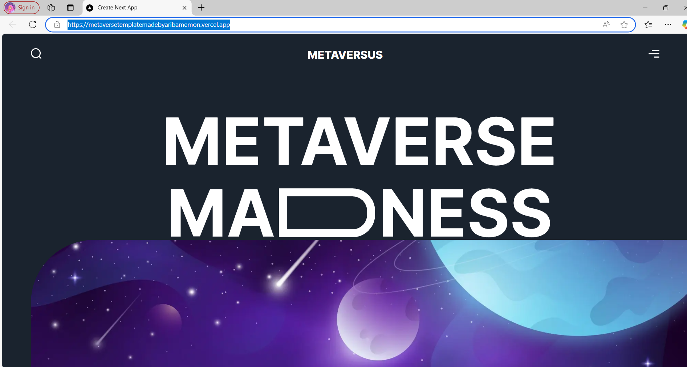
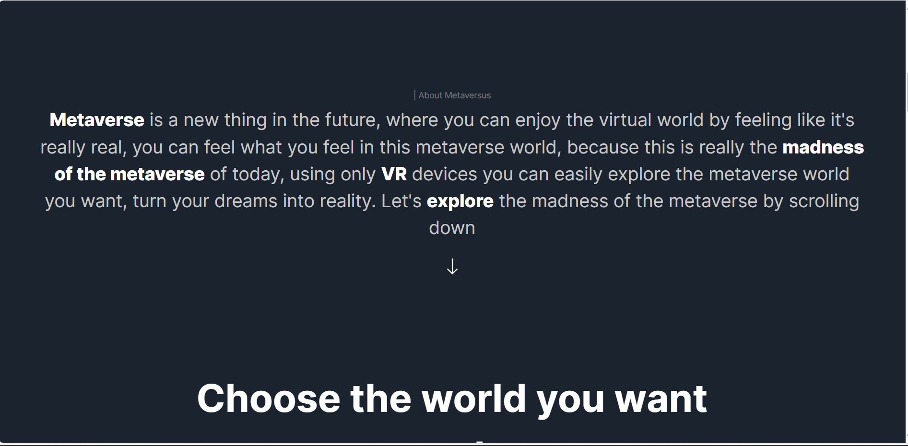
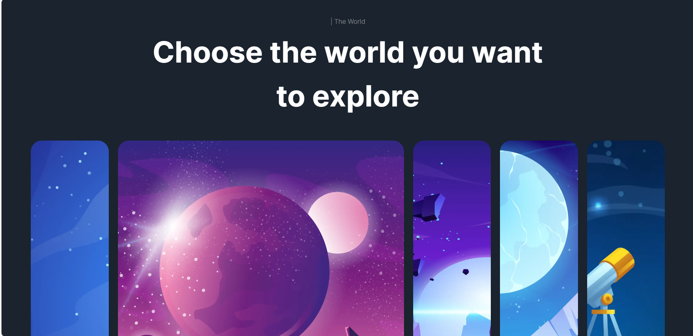
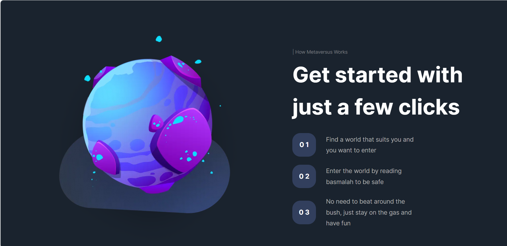
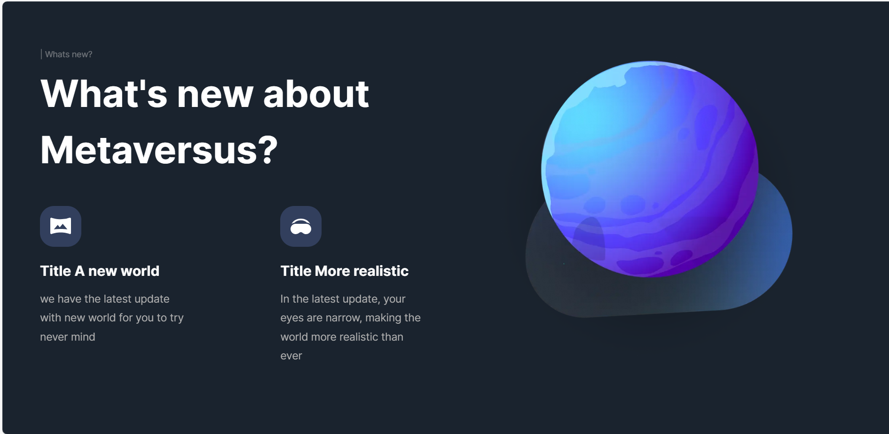
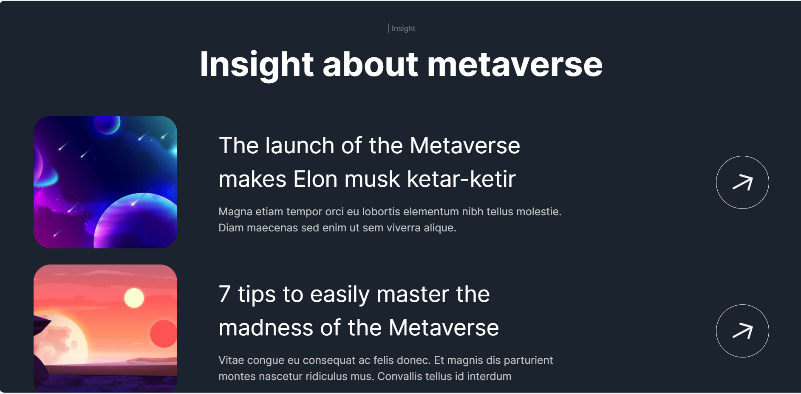
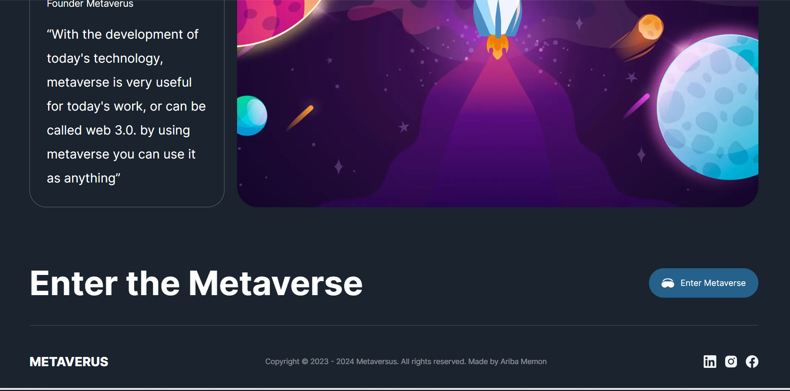

# Getting Started

# Project Overview 
The Metaverse Template
A Next.js template for building modern, responsive Metaverse applications with TypeScript and Tailwind CSS.

This template serves as a starting point for Metaverse projects, offering a highly responsive design, TypeScript integration for type safety, and Tailwind CSS for rapid styling.
Key Features
•	Next.js framework for fast, optimized applications
•	TypeScript for robust and scalable code
•	Tailwind CSS for utility-first styling
•	SEO-friendly structure with custom meta tags
•	Fully responsive design out of the box

Key Features
Next.js Framework: Experience fast, efficient server-side rendering and optimized static site generation for a blazing-fast application.
Tailwind CSS: Style easily using Tailwind's utility-first approach, allowing you to build complex, responsive designs without custom CSS.
Fully Responsive: Mobile-first design to ensure an outstanding experience across all devices.
Highly Customizable: Easily tweak components and styles to suit your brand and product needs.

## Prerequisites
- Node.js and yarn/bun installed
- NextJS
- Tailwind CSS
- TypeScript

## Setup
1.	Clone the Repository:
git clone chmajidnaeem/metaverse-template: Metaverse Template
cd metaverse-template
2.	Install Dependencies: npm install
3.	Run the Development Server:
4.	View the Application:
Open http://localhost:3000 in your browser to see the application in action.

🔧 Commands
•	Development: npm run dev
🛠️ Technology Stack
•	Next.js for server-side rendering
•	TypeScript for type safety and improved tooling
•	Tailwind CSS for responsive and efficient styling

